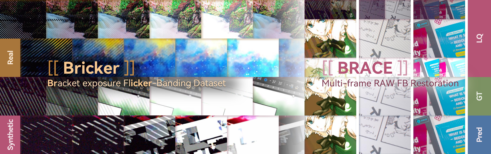
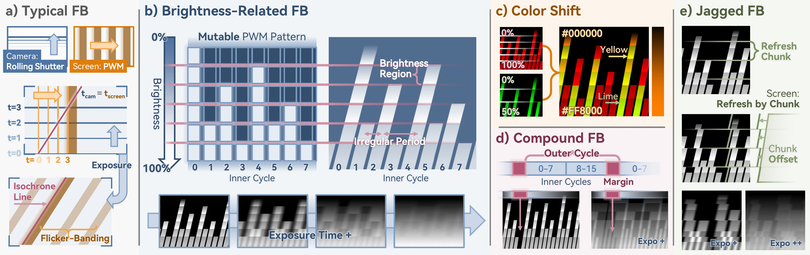
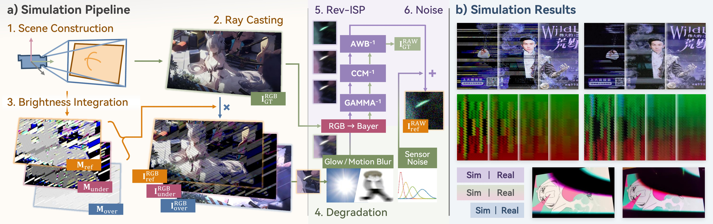
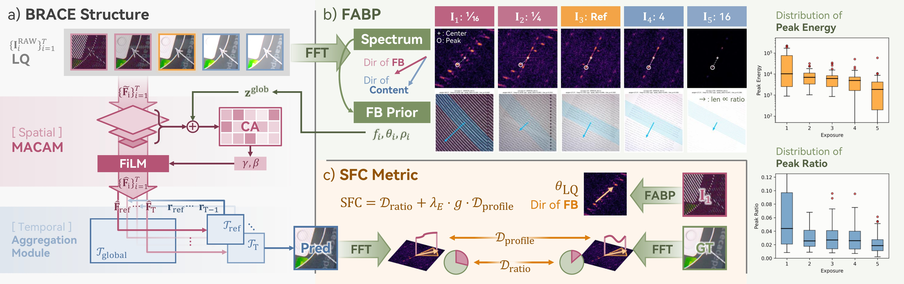
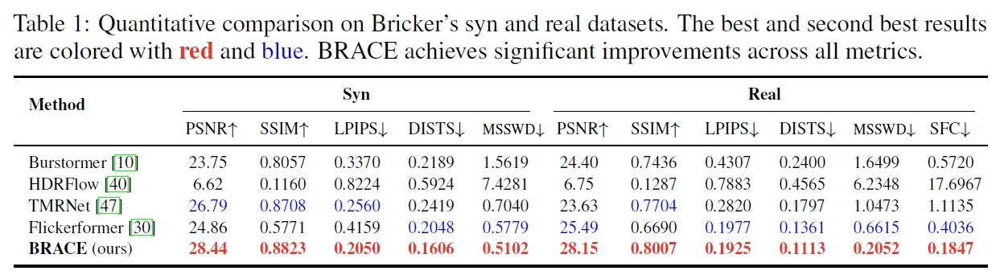
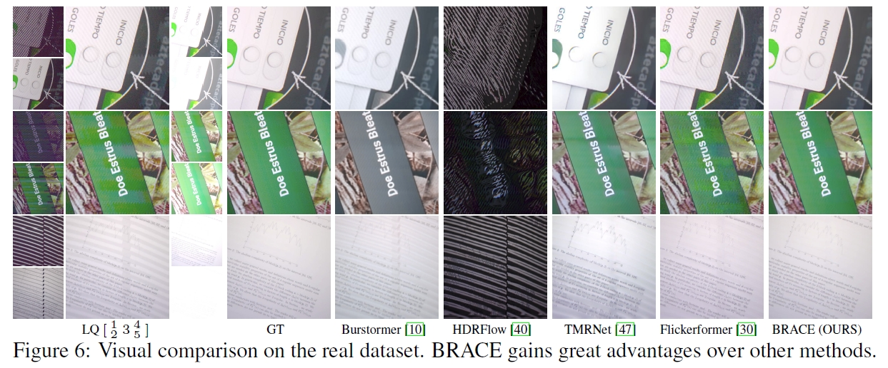

<!-- <div align="center">
  <p align="center">
    
  </p>
</div> -->

# Bricker to BRACE: A Bracket Exposure RAW Dataset and Restoration Model for Flicker-Banding

[Zihan Zhou](https://github.com/ZZH-qwq), [Libo Zhu](https://github.com/libozhu03), [Jue Gong](https://github.com/gobunu), [Zhiyi Zhou](https://github.com/ZhiyiZZhou), [Jiezhang Cao](), [Yong Guo](), [Yulun Zhang](http://yulunzhang.com/)  
**"Bricker to BRACE: A Bracket Exposure RAW Dataset and Restoration Model for Flicker-Banding", arXiv 2026**

[](https://zzh-qwq.github.io/BRACE/)
[](https://arxiv.org/abs/2606.29845)
[](https://github.com/ZZH-qwq/BRACE)
[](https://github.com/ZZH-qwq/BRACE)

<p align="center">
   
</p>

---

## 📚 Table of Contents

- [📚 Table of Contents](#-table-of-contents)
- [🔥 News](#-news)
- [📘 Abstract](#-abstract)
- [📝 Structure Overview](#-structure-overview)
- [⚙️ Installation](#️-installation)
- [📥 Download Pretrained Models and Datasets](#-download-pretrained-models-and-datasets)
- [🧪 Inference](#-inference)
- [ 🔎 Results](#--results)
- [📝 Acknowledgements](#-acknowledgements)
- [📌 Citation](#-citation)

---

## 🔥 News
- **[2026-05-26]** Create repository.

### ⭐⭐⭐ If BRACE is helpful to your projects, please help star this repo. Thanks!


## 📘 Abstract

> *Flicker-banding* (FB), arises from temporal aliasing between a camera's rolling shutter and a display's brightness modulation, degrading screen-captured image readability with color shifts and jagged patterns. Existing single-frame methods with simplified parametric stripe models cannot reliably distinguish these artifacts from genuine texture. To address this, we conduct a systematic analysis of complex FB morphologies and reveal their significant variation across exposure settings, motivating a multi-frame bracketed RAW restoration paradigm. We construct **Bricker**, a synthetic–real bracketed RAW dataset built via ray-tracing-based physical simulation and automated multi-exposure capture tool. We further propose **BRACE**: Bracketed RAW Flicker-Banding Removal, a multi-frame restoration model that utilizes frequency-aware banding prior and a multi-scale spatial cross-attention modulator (MSCAM) for cross-exposure spatial fusion. We also introduce the Stripe Frequency Consistency (SFC) metric to evaluate banding removal. Experiments demonstrate state-of-the-art performance on both synthetic and real benchmarks. Our dataset and code are available at: [https://github.com/ZZH-qwq/BRACE](https://github.com/ZZH-qwq/BRACE).


## 📝 Structure Overview

<p align="center">
   <br>
    <em>Figure 1. Complex FB morphologies commonly observed in real captures. The examples shown here are rendered using our physics-driven simulation pipeline.</em>
</p>

<p align="center">
   <br>
    <em>Figure 2. Overview of the proposed synthetic data generation pipeline. a) The physics-driven simulation pipeline. b) Comparison of FB patterns generated by our pipeline and real captures.</em>
</p>

<p align="center">
   <br>
    <em>Figure 3. Overview of our BRACE model architecture.</em>
</p>


## ⚙️ Installation

TODO


## 📥 Download Pretrained Models and Datasets

TODO


## 🧪 Inference

TODO


## <a name="-results"></a> 🔎 Results

BRACE significantly outperforms previous methods on both synthetic and real benchmarks.

<details>
<summary> 📊 Quantitative comparisons on Bricker's synthetic and real benchmark (click to expand)</summary>

<p align="center">
  
</p>
</details>

<details>
<summary> 🖼 Visual comparison on Bricker's real benchmark (click to expand)
</summary>

<p align="center">
  
</p>
</details>


## 📝 Acknowledgements

We would like to thank the developers and maintainers of [BracketIRE](https://github.com/cszhilu1998/BracketIRE/), [RIFLE](https://github.com/libozhu03/RIFLE), and [CLEAR](https://github.com/libozhu03/CLEAR) for their open-source contributions, which have greatly facilitated our research and development.

This project is supported in part by the Shanghai Jiao Tong University Artificial Intelligence Institute.

We also thank our collaborators and contributors for their valuable feedback and technical discussions.

## 📌 Citation

```bibtex
@article{zhou2026bricker,
  title={{Bricker to BRACE}: A Bracket Exposure RAW Dataset and Restoration Model for Flicker-Banding},
  author={Zihan, Zhou and Libo, Zhu and Jue, Gong and Zhiyi, Zhou and Jiezhang, Cao and Yong, Guo and Yulun, Zhang},
  journal={arXiv preprint arXiv:2606.29845},
  year={2026}
}
```
